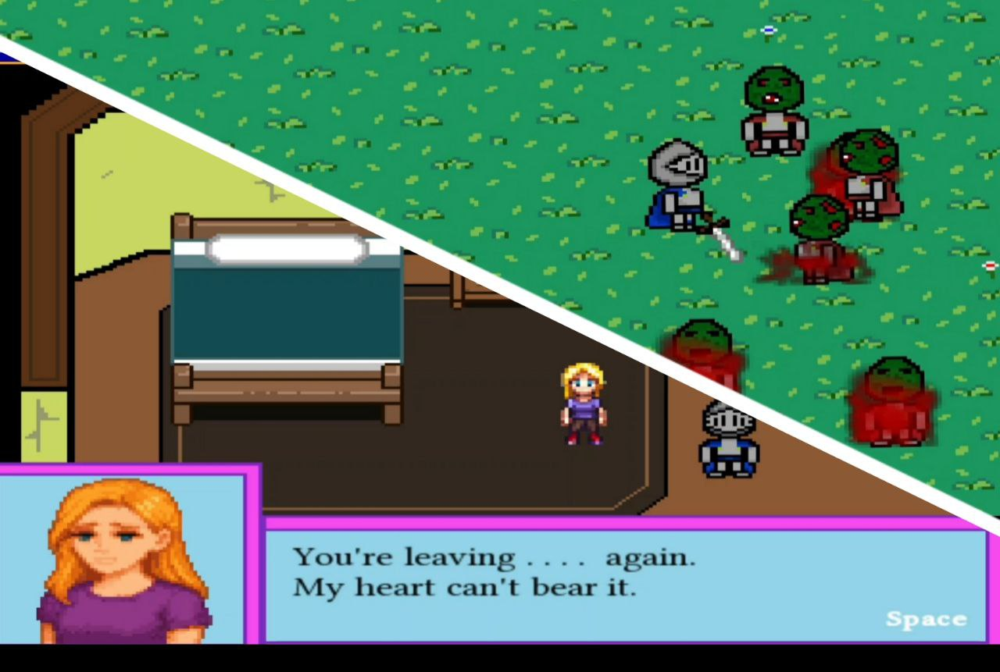

# 2D Pixel Game

A small **2D top-down pixel game** made with **C++ and SFML**.  

## Game Video

## Game Features

- Move your character in a 2D world  
- Simple enemies and fighting  
- simple dialog 

## Requirements

- C++ compiler   
- SFML library installed  

## Setup and Run

1. Clone the repo:
2. Open the project in your C++ IDE (Visual Studio, Code::Blocks, etc.)  
3. Make sure **SFML is linked** correctly.  
4. Build and run the executable.  

## Notes

- This is a **learning project**, mainly for practicing C++ and SFML.  
- Controls, gameplay, and graphics are simple and easy to expand.
- the RAR file is pre-compiled and ready to run. just extract it then run the .exe file.
